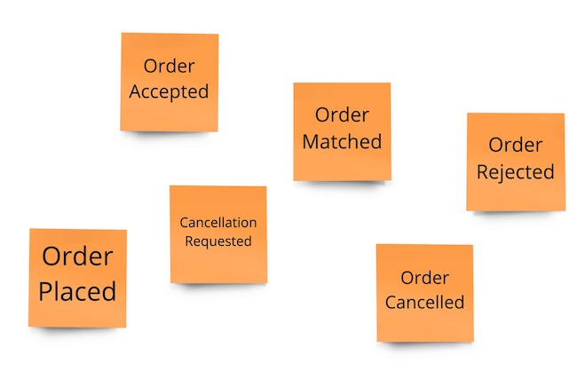
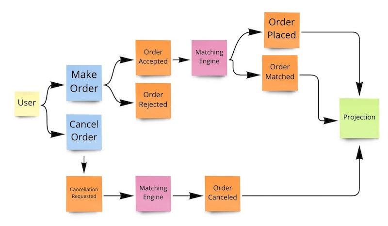
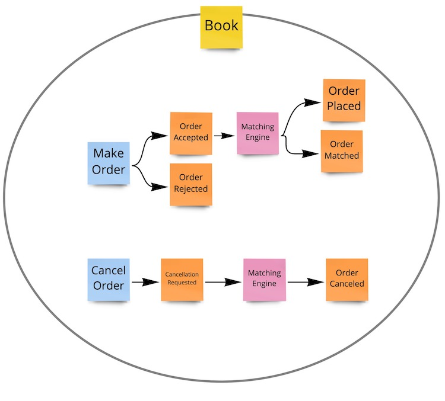

# Reactive Stock Market

### Introduction

This project takes you through the design of simple reactive stock market application.

Sole purpose of this project is to educate.

#### Takeaways:
- Spring Boot application with matching engine as it core
- Matching engine supports limit order
- Matching engine is implemented using Max-Heap and Min-Heap
- Lightweight and custom-built Reactive CQRS framework
- Lockless - light thread synchronisation and good scalability potential
- In-memory storage only
- Supports backpressure and event streaming

### Anatomy

- **Matching engine**
    + [Matching Engine](src/main/java/com/github/schananas/reactivestockmarket/domain/engine/MatchingEngine.java) uses Max-Heap and Min-Heap
    + Time complexity for critical operations are as:
        + Add – O(log N)
        + Cancel – O(1)
    + Buy tree - The collection of orders sorted in the ascending order, that is, higher buy prices have priority to be matched over lower
    + Sell tree - The collection of orders in the descending order, that is, lower sell prices have priority to be matched over higher
    + Each state transition is the consequence of an event. Events are played sequentially and therefore engine is single-threaded

- **Reactive**
    + Asynchronous, event driven, non-blocking programming perfectly fits for given project. We want to react to engine events when they happen instead of waiting and blocking the threads
    + Business logic can be broken down into a pipeline of steps where each of the steps can be executed asynchronously
    + Using Reactor most parallelism and concurrency in project is carefully handled
    + Operations are optimised to execute in parallel when possible. For example orders within single asset are executed sequentially, but orders of distinct assets are executed in parallel

- **DDD**
    + The goal of domain-driven design (DDD) is to establish a ubiquitous language and detailed understanding of the business needs and processes
    + This allows the business domain experts (those most familiar with the stock trading domain) to communicate their domain knowledge with the rest of the team.
    + Event storming and DDD allow us to model our system in an asynchronous way, which is suitable for reactive, cloud-native systems
  

- **CQRS**
    + Greatly simplifies architecture, scalability and modularity
    + Order requests are modeled as commands. Command handlers validates request and then either accepts or reject order request
    + All state changes can be modeled as events, and can be stored and replayed if needed. Lack of concurrency between events also ensures determinism and makes code much cleaner and more efficient to run
    + This avoids need to store complicated states and structures in database, instead if needed in-memory state can be reconstructed based on past events
    + Uses projections to separate engine state and business state used for querying. We are able to build highly optimised projections based on business needs. We can query them without need to peek into engine state, and avoid potential performance congestions

- **Protobuf**
    + Describes API schema once, in proto format (see [api.proto](src/main/resources/api.proto))
    + Supports backward compatibility
    + The Protocol Buffers specification is implemented in many languages
    + Less Boilerplate Code - auto generated code

### Event storming

Event storming is a workshop-based method to quickly find out what is happening in the domain and to describe business needs.
This model is based upon easy to understand and follow [Event Storming template by Judith Birmoser]( https://miro.com/miroverse/event-storming/?utm_source%3Dgoogle%26utm_medium%3Dcpc%26utm_campaign%3DS|GOO|NB|Tier2|ALL-EN|Core%26utm_adgroup=dsa%26adgroupid=116435751323%26utm_custom%3D12123522200%26utm_content%3D492751716473%26utm_term%3D%26matchtype=%26device=c%26location=1028595&gclid=CjwKCAjwwdWVBhA4EiwAjcYJEJPbxGrRjNnNieMFEhNtVSMG6_3fq2uPVYze0OL-bK_JCNdh4rGAEBoCvEMQAvD_BwE?social=copy-link
)

 - **Terminology**

 + **Domain Event** - An event that occurs in the business process. Written in past tense.
 + **User/Actor** - A person who executes a command through a view.
 + **Business Process** - Processes a command according to business rules and logic. Creates one or more domain events.
 + **Command** - A command executed by a user through a view on an aggregate that results in the creation of a domain event.
 + **Aggregate** - Cluster of domain objects that can be  treated as a single unit.
 + **View / Read Model** - A view that users interact with to  carry out a task in the system.
 

 - **Collect Domain Events (Big Picture)**

Here we are trying to imagine which events our system is going to use.
As it's a simple stock market, following events are imagined to occur:

System needs to either accept or reject order after validation (minimum amount larger than zero, enough amount on account, trading not paused, etc...)
So we have two events: Order Accepted and Order Rejected.

Then we need some events that our matching engine can produce. It may match an order immediately or place order in book if order can't be matched immediately.
Two more on the board: Order Placed and Order Matched.

Next we would like to allow our users to cancel their orders if possible.
First users need to request to cancel order, if such request can be fulfilled order gets canceled, fully or partially.
Last two events: Order Cancellation Requested and Order Cancelled.

 - **Refine Domain Events**

Now we arrange events in order they could happen and group them together.

Events Order Accepted, Order Rejected, Cancellation Requested are consequence of user initiated commands.
In the project we will mark them as sourcing events as they are used to changing aggregate state and projection.

Events Order Placed, Order Matched and Order Cancelled are consequence of business process (matching engine).
We will mark them as Update Events in the project, because they are used only to update project, and they can't influence aggregate state.

- **Process modeling**

Now that we know who creates which event, lets add these actors into picture

- **Finding aggregates**

As this is a simple stock market application, without user management, security, payment system integration, etc. finding aggregate is easy: there is only one!
This aggregate will represent our book of a single asset/instrument.

### Reactive vs Blocking

Thread-based architectures just don’t scale that well. There is a limit to how many threads can be created, fit into memory and managed at a time. The reactor pattern removes this problem by simply demultiplexing concurrent incoming requests and running them, on a (usually) single-application thread.

**Blocking**

Let's consider the case when two users are trying to access same component or resource.

To avoid concurrency issues every component needs to be synchronized in some way. Usually we use locks to assure only one user can access shared component at the time.
If component is already used by another user we need to wait for our turn by blocking on a lock. Implications are that every component on an execution path needs to be optimized for concurrent usage, which adds extra complexity and increases chances for concurrency issues, which are hard to find and cover with tests.
Second problem is scalability. N users would span N threads that are competing against each other to access component. Usually time of thread synchronisation and context switch is negligible, but as number of users (threads) grow, this time has more impact on our performance. 

**Reactive**

So how can we reduce complexity and improve performance for high load? In this project all user "intents" of user interaction with system are modeled as commands.

Using reactor pattern commands are de-multiplexed (see [CommandBus:80](src/main/java/com/github/schananas/reactivestockmarket/domain/bus/CommandBus.java)) to a single "flow" of execution. Word flow is used instead of thread here, as threads can arbitrarily be changed in Project Reactor, but that doesn't matter as we model our flow in such way that we know which components can be only accessed sequentially and which concurrently.
Then we place our components within this flow. Each component executes one intent/command at the time, like any synchronized component from blocking example would. Once command is executed, next is taken from flow and gets executed. There is also option to specify what is maximum time allowed to access component, preventing potential congestion. 
Now components can be single threaded without any concurrency protection complexity.
Once all steps from flow have been executed, user is asynchronously notified with response.

**Reactive with parallel execution**

So what if some components can be accessed in parallel? In case of this project, if two users are bidding for distinct assets/instruments we can execute their orders in parallel as assets are two logically separated components. (see [Book aggregate](src/main/java/com/github/schananas/reactivestockmarket/domain/Book.java))
In this case we just multiplex flow again and split it to two separate flows, each executing commands and orders for distinct assets. (see [CommandBus:51](src/main/java/com/github/schananas/reactivestockmarket/domain/bus/CommandBus.java))

**Reactive stock market**

Applying reactive pattern to our reactive stock market we get following flow:

First step is to de-multiplex user commands to preserve order of commands and to deal easier with further parallelism and concurrency.
Now we can multiplex pipeline for each aggregate id (instrument id), meaning we will execute commands for distinct assets in parallel.
Now as we have parallel pipelines for distinct instruments, we remove most of the synchronisation from our components like Matching Engine.
Question arises, why are [aggregate](src/main/java/com/github/schananas/reactivestockmarket/domain/BookAggregateRepository.java) and [query](src/main/java/com/github/schananas/reactivestockmarket/domain/query/BookQueryRepository.java) repository represented as non-shared components, when they are singletons which all pipelines can access concurrently?
Both components use ConcurrentHashMap which in contract to SynchronizedMap is not locking whole map on update. Instead, ConcurrentHashMap is divided into segments and each segment maintains its own lock. Any thread that wants to enter into segment have to acquire that segments lock.
Number of segments is decided by the parameter called `Config::DEFAULT_CONCURRENCY_LEVEL` which is passed while instantiating ConcurrentHashMap. As we multiplexed our pipelines per instrument id, we know that each pipleline will access map segments sequentialy, therefore whole pipleline remains lockless.

**How to scale?** 

With reactive and lockless implementation scaling options become more apparent.
Vertical scaling by adding more memory and CPU cores would allow application to handle more assets in parallel and investing into CPU with good single thread performance would directly impact matching engine performance.
Horizontal scaling would require deploying multiple instances of this application as microservices so that they can run in parallel across multiple machines. Then highly traded instrument could be handled on dedicated machine while all other can be handled by one shared machine.  

### Double vs BigDecimal
Floats and doubles cannot accurately represent the base 10 multiples that we use for money.
This issue isn't just for Java, it's for any programming language that uses base 2 floating-point types.

This project uses [BigDecimal](https://docs.oracle.com/javase/8/docs/api/java/math/BigDecimal.html#:~:text=A%20BigDecimal%20consists%20of%20an,the%20negation%20of%20the%20scale.) for representing numbers.
The disadvantage of BigDecimal is that it's slower and there are [common pitfalls](https://blogs.oracle.com/javamagazine/post/four-common-pitfalls-of-the-bigdecimal-class-and-how-to-avoid-them) that developer should be aware of.

### Where to go from here

- **Embrace eventual consistency**: Synchronous systems rely on request/response semantics as in, we invoke a method or REST endpoint and expect a response. This project implements this approach due to original system requirements.
  Better approach would be to subscribe to a dedicated SSE or WebSocket endpoint which will emit all the events once they have been materialized. After all UI is just one type of projection, so build it same as any other projection!
  **_Further contributions of this project will aim to demonstrate this approach too._**
- **Going to production**: As you probably noticed this project stores all events in memory and its long way from being production ready. Sole purpose of this project is to educate.
  It may fool you that writing your own CQRS Reactive framework is easy. There are many things that CQRS framework should be able to handle which are not implemented in this project, like snapshots, persistent storage support, upcasting, event processors that allows you to replay events etc...
  If you are looking for production ready alternative, [Axon Framework](https://github.com/AxonFramework/AxonFramework) could be a good staring point. Axon Framework is feature rich framework that is available for years now witch established community and large number of extensions. It also supports variety of Event Stores and message brokers. If you need something more lightweight, another interesting reactive and function framework that you should take a look is [FModel](https://github.com/fraktalio/fmodel).

### Tests

- [x] Unit tests
- [x] Integration tests
- [x] Load test

### How to run

Execute `mvn clean install` to build project and generate protobuf classes.

Then execute `mvn spring-boot:run` to run application, or use IDE of choice to run application as Spring Boot application.
